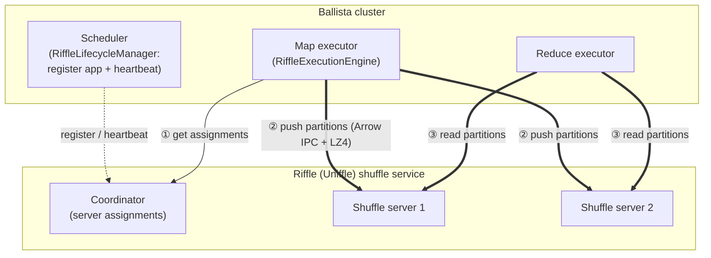

# ballista-riffle

[Riffle](https://github.com/zuston/riffle) (Apache Uniffle) remote shuffle service extension for [Apache Ballista](https://github.com/apache/datafusion-ballista).

## Overview

This extension enables Ballista to use Riffle as a remote shuffle backend, decoupling compute from storage for disaggregated architectures. Instead of writing shuffle data to local disk, executors push partition data to dedicated Riffle shuffle servers. Reducers read from the shuffle servers directly.

## Architecture



1. The **scheduler** registers the application with the Riffle coordinator when a job starts and heartbeats to keep it alive (`RiffleLifecycleManager`).
2. **Map tasks** ask the coordinator which shuffle server owns each output partition, then push partition data there instead of writing to local disk (`RiffleExecutionEngine`).
3. **Reduce tasks** read their input partitions directly from the assigned shuffle servers.

## Features

- Full Uniffle gRPC protocol support (register, push, read, report, commit, heartbeat)
- Arrow IPC serialization with LZ4 compression
- Multi-block deserialization (handles multiple mappers writing to same partition)
- Per-partition server routing via coordinator assignments
- Chunked writes for large partitions (configurable `max_block_size`)
- Retry logic with exponential backoff on transient errors
- Uniffle-compatible block ID encoding
- Paginated reads for partitions > 64MB
- Scheduler lifecycle management (register app, heartbeat, cleanup)

## Usage

This crate follows the [Ballista extension pattern](https://github.com/milenkovicm/ballista_extensions). The integration point is `RiffleExecutionEngine`, which you install on a Ballista executor through the `override_execution_engine` hook:

```rust
use std::sync::Arc;
use ballista_executor::executor_process::{ExecutorProcessConfig, start_executor_process};
use ballista_riffle::config::RiffleConfig;
use ballista_riffle::execution_engine::RiffleExecutionEngine;

#[tokio::main]
async fn main() -> ballista_core::error::Result<()> {
    let riffle_config = RiffleConfig {
        coordinator_host: "localhost".to_string(),
        coordinator_port: 19999,
        ..Default::default()
    };

    let config = ExecutorProcessConfig {
        override_execution_engine: Some(Arc::new(RiffleExecutionEngine::new(riffle_config))),
        ..Default::default()
    };

    start_executor_process(Arc::new(config)).await
}
```

### Configuration

`RiffleConfig` controls how the client talks to Riffle. Every field has a default (see `RiffleConfig::default()`):

| Field | Default | Description |
| --- | --- | --- |
| `coordinator_host` | `localhost` | Riffle coordinator hostname. |
| `coordinator_port` | `19999` | Riffle coordinator gRPC port. |
| `app_id` | `""` | Application id; set per job by the engine in a cluster. |
| `data_replica_write` | `1` | Number of shuffle servers each block is written to. |
| `data_replica_read` | `1` | Number of shuffle servers each block is read from. |
| `connect_timeout` | `10s` | Connection timeout. |
| `request_timeout` | `30s` | Per-request timeout. |
| `max_block_size` | `32 MiB` | Partitions larger than this are chunked into multiple blocks. |
| `heartbeat_interval_secs` | `10` | App heartbeat interval (scheduler side). |

### Examples

Runnable examples live in [`examples/`](examples):

- [`executor.rs`](examples/executor.rs) — set up a Ballista executor backed by Riffle.
- [`riffle_config.rs`](examples/riffle_config.rs) — configure the client, connect to a coordinator, and fetch shuffle-server assignments (a quick way to verify your Riffle deployment is reachable).

```bash
# Bring up a local Riffle cluster first (see docker/), then:
cargo run --example riffle_config
cargo run --example executor
```

## Testing

```bash
# Unit tests (no Docker needed)
cargo test

# Integration tests with testcontainers (needs Docker + riffle-test image)
# Build the image first:
#   cd docker && docker build -t riffle-test .
cargo test --features testcontainers
```

## License

Apache License 2.0
